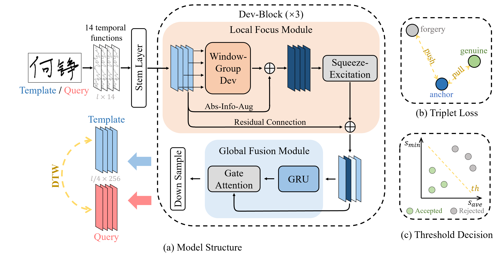
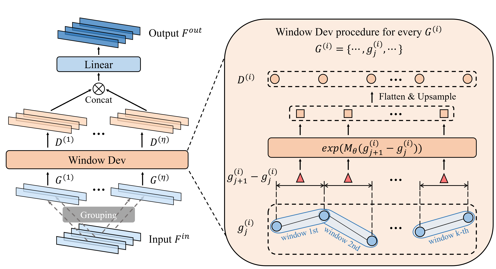

# DevInSight: Weaving Path Development Into Online Signature Verification

[](https://link.springer.com/chapter/10.1007/978-3-032-04630-7_23)
[](LICENSE)

Official implementation of the paper **"DevInSight: Weaving Path Development Into Online Signature Verification"**, accepted at **ICDAR 2025**.

DevInSight is a novel **automatic online handwritten signature verification model** that introduces a trainable [**Path Development (Dev)**](https://github.com/PDevNet/DevNet) module as its core component.


## 📌 Overview
The main contributions of this paper are as follows:

- We propose a robust online handwritten signature verification model based on Path Development and DTW, effectively addressing challenges in cross-session verification. We build online signature representation model by hier-archically stacking Dev layers, and build DTW-based verifier upon.

- We enhance the representation performance of Dev by introducing several techniques, including Windowing Strategy, Grouping Strategy and Absolute-Information-Augmentation. Furthermore, we propose the Local Focus Module (LFM) based on the enhanced Dev to effectively capture local correlations, and the Global Fusion Module (GFM), which leverages GRU to capture long-term dependencies in time series features.

- Experiments on two large datasets in different languages demonstrate compet-itive performance of DevInSight compared to existing methods. Furthermore, we extend our model to handwritten digit string verification, demonstrating its ability to generalize to other forms of handwritten content.

<div align="center">
  
  <p>💡 <em>Figure 1: Overall architecture of DevInSight.</em></p>
</div>

<div align="center">
  
  <p>💡 <em>Figure 2: Workflow of Window-Group Dev, incorporating Dev with Windowing and Grouping Strategies.</em></p>
</div>


## 📚 Citation

If you find this work useful or use our code in your research, please cite our paper:

```bibtex
@inproceedings{devinsight2025shi,
    title={DevInSight: Weaving Path Development Into Online Signature Verification},
    author={Shi, Yilin and Jiang, Lei and Ni, Hao and Jin, Lianwen},
    booktitle={2025 International Conference on Document Analysis and Recognition (ICDAR)},
    pages={398--415},
    year={2025},
    organization={IEEE}
}